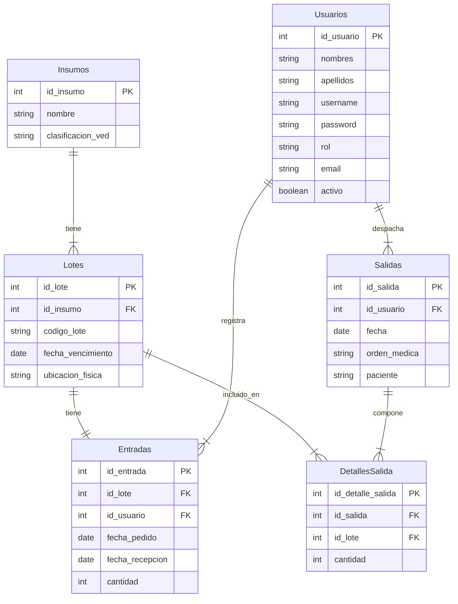
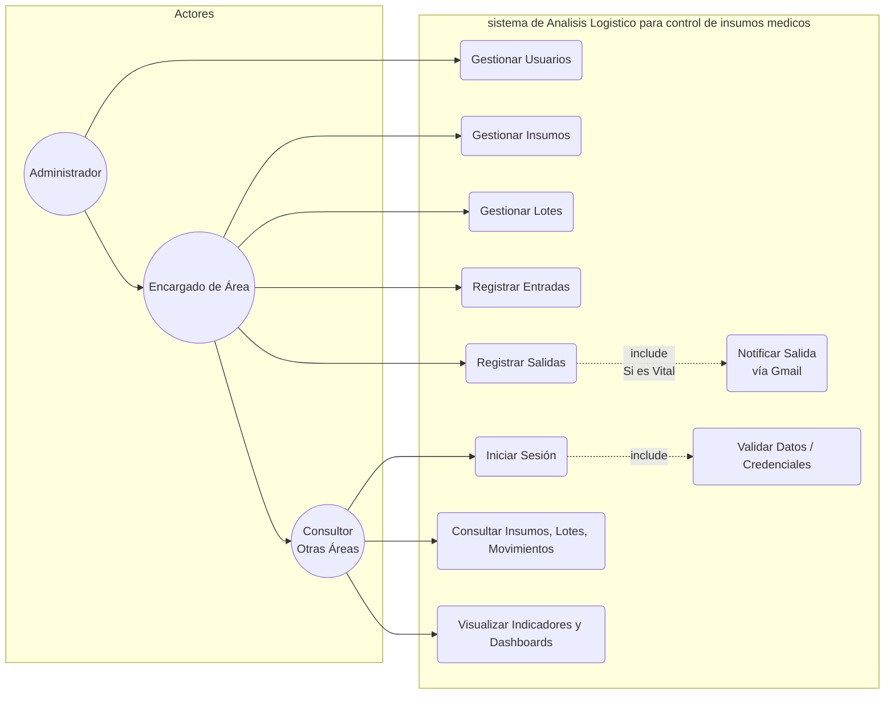
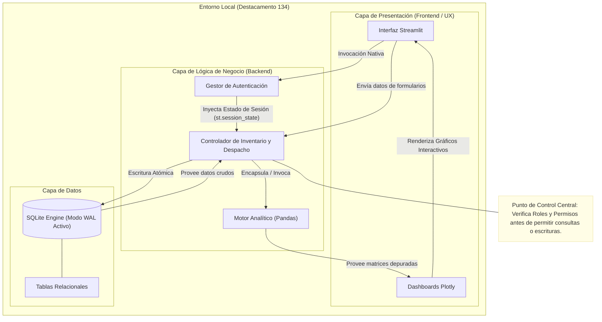
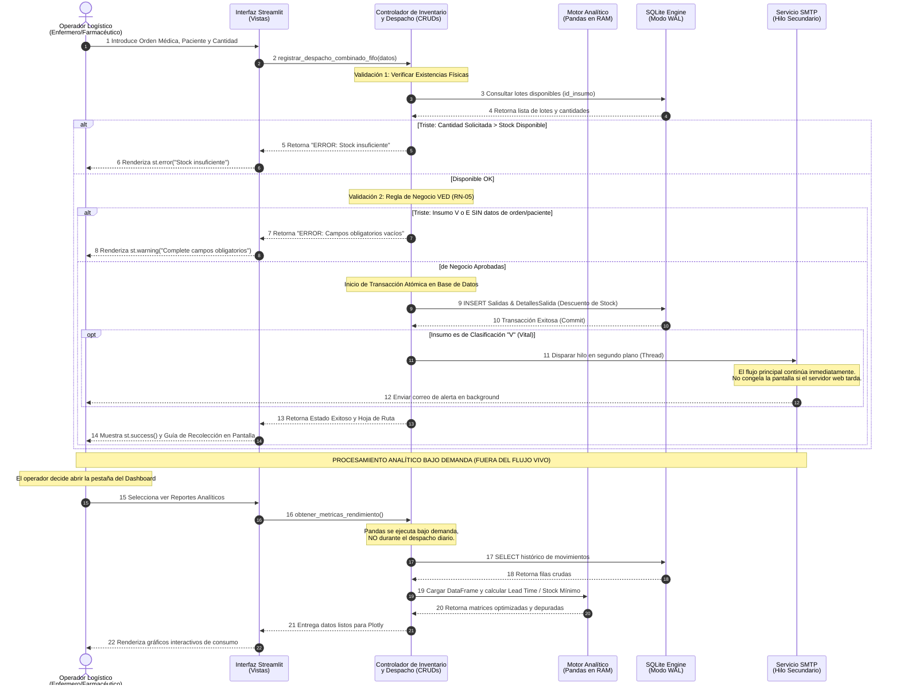
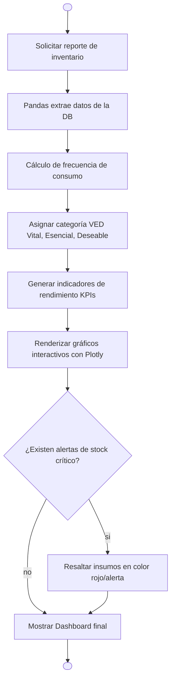

# SIAL-MED: Aplicación Web de Análisis Logístico para el Control de Insumos Médicos

### 🏥 Destacamento 134 de la Guardia Nacional Bolivariana (Dabajuro, Edo. Falcón)

---

## 📝 Descripción General

**SIAL-MED** es una plataforma web de ingeniería y analítica logística diseñada para optimizar, controlar y auditar el flujo de inventario médico del **Destacamento 134 de la GNB**. El sistema mitiga la incertidumbre en el reabastecimiento mediante el cálculo automatizado de métricas como el *Lead Time* de proveedores, la aplicación de la matriz de criticidad VED (Vital, Esencial, Deseable) y la ejecución de algoritmos de despacho basados estrictamente en el criterio **FEFO** (*First Expired, First Out*).

Además, el sistema cuenta con un módulo de gobernanza que restringe acciones según el rol del usuario y dispara alertas automatizadas por protocolo SMTP (Gmail) en tiempo real cuando ocurren salidas de insumos clasificados como **Vitales**.

> ⚠️ **Nota de Estado del Proyecto:** El sistema se encuentra actualmente en su **fase de desarrollo y construcción activa** (Avance #3). Se ha consolidado con éxito la arquitectura base, la estructura de persistencia local, las políticas de gobernanza, el pipeline de integración continua y la paridad de entornos. Los módulos avanzados de interfaz de usuario y analítica matemática se irán expandiendo en los próximos ciclos de trabajo.

---

## 🛠️ Arquitectura del Sistema (Doc-as-Code)

La arquitectura de SIAL-MED está programada en su totalidad utilizando bloques sintácticos de **Mermaid.js**, permitiendo su renderizado nativo y dinámico dentro de la interfaz de GitHub sin depender de imágenes externas.

### 1. Diagrama Entidad-Relación

---

### 2. Diagrama de Casos de Uso

---

### 3. Diagrama de Arquitectura 

---

### 4. Diagrama de Secuencia 

### ⏱Diagrama de Secuencia: Registro de Salida Médica

---

### 5. Diagramas de Flujo 

### 🔄 Diagrama de Flujo: Registro de Salida Médica 

#### Flujo B: Procesamiento Analítico del Inventario
### 📊 Diagrama de Flujo 2: Procesamiento Analítico de Inventario

---

🚀 Guía de Instalación Determinista
El objetivo de esta guía es garantizar que cualquier desarrollador pueda desplegar y operar el sistema de forma autónoma en el menor tiempo posible, obteniendo un entorno local idéntico al de producción.

Requisitos Mínimos del Sistema
Python 3.8 (o superior) instalado globalmente.

Git instalado y configurado en la máquina local.

Pasos Exactos para el Despliegue Local
Clonar el repositorio oficial:

Bash
   git clone [https://github.com/Emmanueljsf/Proyect-Analisis-Logistico-.git](https://github.com/Emmanueljsf/Proyect-Analisis-Logistico-.git)
   cd Proyect-Analisis-Logistico-

Crear e inicializar el entorno virtual aislado:
Esto evita conflictos con librerías globales de la máquina.

Bash
   python -m venv env
   # En Windows (Ejecutar en PowerShell):
   .\env\Scripts\Activate.ps1
   # En Linux / macOS:
   source env/bin/activate

Instalar las dependencias del proyecto:
La instalación es determinista y utiliza las versiones exactas congeladas en el manifiesto.

Bash
   pip install --upgrade pip
   pip install -r requirements.txt

Configurar el archivo de variables de entorno:
Cree una copia local de la plantilla de configuración (el archivo .env real está protegido por el .gitignore y jamás se subirá al repositorio público).

Bash
   cp .env.example .env

Nota: Proceda a abrir el archivo .env generado con su editor de texto y rellene las credenciales SMTP locales con sus datos de prueba personalizados.

Iniciar el servidor local de SIAL-MED:
Bash
   streamlit run app.py

   
🔑 Configuración de Variables de Entorno
El sistema se rige bajo el principio de paridad de entornos. A continuación se detalla el propósito de cada variable requerida en el archivo .env para la correcta inicialización del software:

PORT: Puerto de red para la escucha de la aplicación web (Valor por defecto: 8501).

ENVIRONMENT: Define el comportamiento del sistema frente a errores y logs (development para depuración local o production para despliegue final).

DATABASE_URL: Cadena de conexión para el mapeo relacional de datos (sqlite:///Control_insumos.db).

EMAIL_HOST: Dirección del servidor de salida para el protocolo de correos (smtp.gmail.com).

EMAIL_PORT: Puerto para conexiones seguras cifradas bajo TLS (587).

EMAIL_USER: Cuenta de correo emisora encargada de enviar las alertas de insumos críticos del destacamento.

EMAIL_PASSWORD: Contraseña de aplicación segura de 16 caracteres generada desde la suite de seguridad de Google Account.

📜 Bitácora de Cambios (Changelog Basado en Commits)
Este proyecto no cuenta con una bitácora escrita de forma manual; el historial de desarrollo se explica de forma autónoma y transparente a través de los mensajes del control de versiones. Gracias a la metodología GitFlow y al estándar de Conventional Commits, cada confirmación en el código define con precisión el progreso técnico del sistema:

feat(ci): Inicialización del flujo de integración continua en la nube a través de GitHub Actions (.github/workflows/ci.yml), encargado de validar la sintaxis de Python (compileall) de manera automática ante cada Pull Request.

docs(architecture): Migración y programación completa de los diagramas de casos de uso, capas y flujos de SIAL-MED en el archivo principal utilizando la sintaxis pura de Mermaid.js (Doc-as-Code).

config(env): Estructuración de las políticas de paridad de entornos mediante la configuración estricta del archivo .gitignore y el diseño de la plantilla técnica .env.example.

docs(governance): Redacción del archivo regulatorio CONTRIBUTING.md para establecer de forma obligatoria las reglas de Peer Review, nomenclatura de ramas auxiliares (feature/, bugfix/, docs/) y formato de confirmaciones.