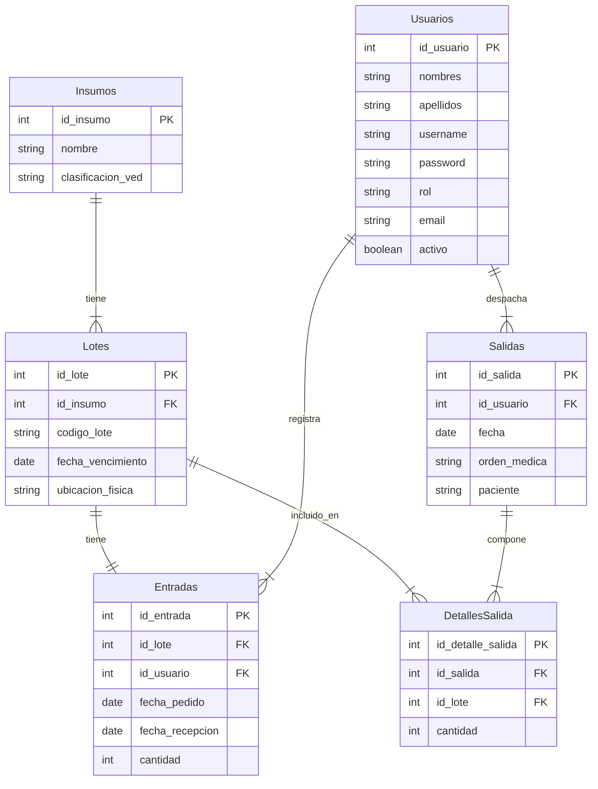
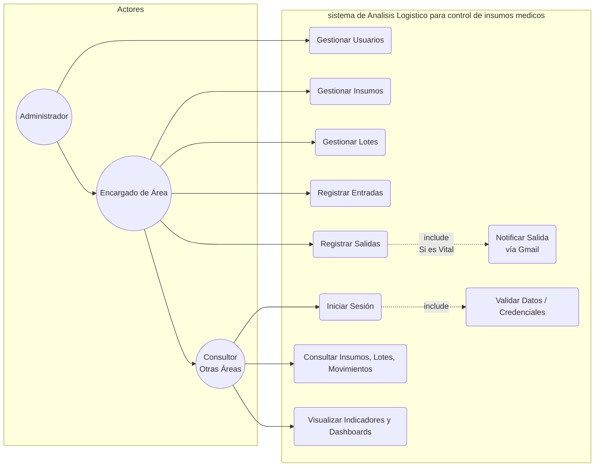
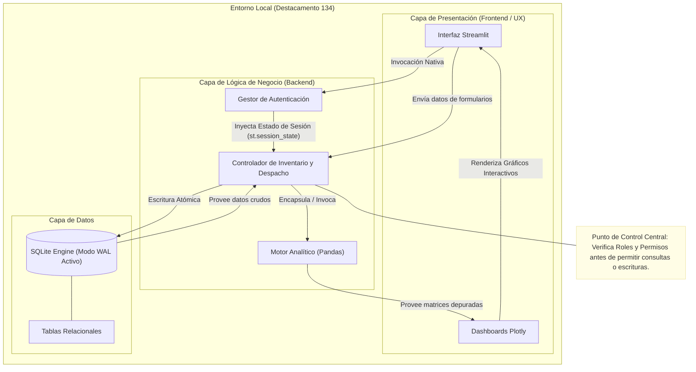
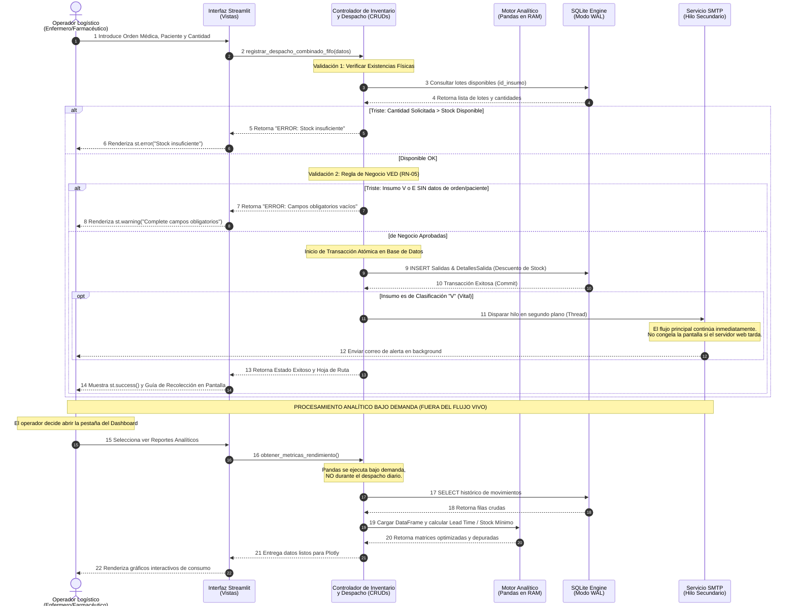
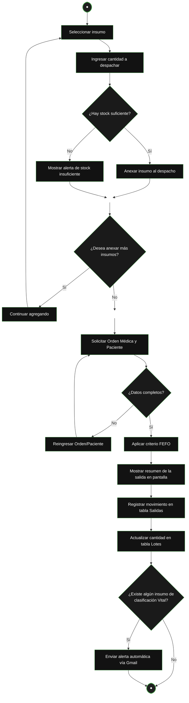

### 1. Diagrama Entidad-Relación

---

### 2. Diagrama de Casos de Uso

---

### 3. Diagrama de Arquitectura 

---

### 4. Diagrama de Secuencia 

### ⏱Diagrama de Secuencia: Registro de Salida Médica

---

### 5. Diagramas de Flujo 

### 🔄 Diagrama de Flujo: Registro de Salida Médica 


#### Flujo B: Procesamiento Analítico del Inventario
### 📊 Diagrama de Flujo 2: Procesamiento Analítico de Inventario
```mermaid
graph TD
    A([ ]) --> B[Solicitar reporte de inventario]
    B --> C[Pandas extrae datos de la DB]
    C --> D[Cálculo de frecuencia de consumo]
    D --> E[Asignar categoría VED Vital, Esencial, Deseable]
    E --> F[Generar indicadores de rendimiento KPIs]
    F --> G[Renderizar gráficos interactivos con Plotly]
    G --> H{¿Existen alertas de stock crítico?}
    
    H -- si --> I[Resaltar insumos en color rojo/alerta]
    H -- no --> J[Mostrar Dashboard final]
    I --> J
    J --> K([ ])